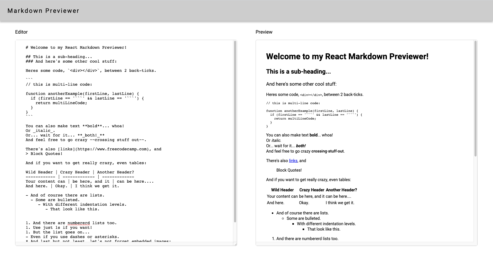

# Markdown Previewer

## freeCodeCamp Front End Libraries Projects - Build a Markdown Previewer

> This project was created while I was learning code from freeCodeCamp.
> Below are the test that I needed to pass while creating this project. Website is not responsive as responsive design was not in requirement.

- User Story #1: I can see a textarea element with a corresponding id="editor".

- User Story #2: I can see an element with a corresponding id="preview".

- User Story #3: When I enter text into the #editor element, the #preview element is updated as I type to display the content of the textarea.

- User Story #4: When I enter GitHub flavored markdown into the #editor element, the text is rendered as HTML in the #preview element as I type (HINT: You don't need to parse Markdown yourself - you can import the Marked library for this: https://cdnjs.com/libraries/marked).

- User Story #5: When my markdown previewer first loads, the default text in the #editor field should contain valid markdown that represents at least one of each of the following elements: a header (H1 size), a sub header (H2 size), a link, inline code, a code block, a list item, a blockquote, an image, and bolded text.

- User Story #6: When my markdown previewer first loads, the default markdown in the #editor field should be rendered as HTML in the #preview element.

## Built With

- javascript
- React
- Styled Components

## Live Demo 🔴

[Markdown Previewer](https://heuristic-hopper-019851.netlify.app/)

## Getting Started

To get a local copy up and running follow these steps:

- Download or clone this this repository and open the zip file to a location of your choosing.
- Open the folder in your code editor.
- run "npm install" in terminal or text editor to install all the dependencies from npm
- run "npm start" to open the page in the browser

### Prerequisites

### This project was bootstrapped with [Create React App](https://github.com/facebook/create-react-app).

## Available Scripts

In the project directory, you can run:

### `npm start`

Runs the app in the development mode. 
Open [http://localhost:3000](http://localhost:3000) to view it in the browser.

The page will reload if you make edits. 
You will also see any lint errors in the console.

### `npm test`

Launches the test runner in the interactive watch mode. 
See the section about [running tests](https://facebook.github.io/create-react-app/docs/running-tests) for more information.

### `npm run build`

Builds the app for production to the `build` folder. 
It correctly bundles React in production mode and optimizes the build for the best performance.

The build is minified and the filenames include the hashes. 
Your app is ready to be deployed!

See the section about [deployment](https://facebook.github.io/create-react-app/docs/deployment) for more information.

### `npm run eject`

**Note: this is a one-way operation. Once you `eject`, you can’t go back!**

If you aren’t satisfied with the build tool and configuration choices, you can `eject` at any time. This command will remove the single build dependency from your project.

Instead, it will copy all the configuration files and the transitive dependencies (Webpack, Babel, ESLint, etc) right into your project so you have full control over them. All of the commands except `eject` will still work, but they will point to the copied scripts so you can tweak them. At this point you’re on your own.

You don’t have to ever use `eject`. The curated feature set is suitable for small and middle deployments, and you shouldn’t feel obligated to use this feature. However we understand that this tool wouldn’t be useful if you couldn’t customize it when you are ready for it.

## Learn More

You can learn more in the [Create React App documentation](https://facebook.github.io/create-react-app/docs/getting-started).

To learn React, check out the [React documentation](https://reactjs.org/).

### Code Splitting

This section has moved here: https://facebook.github.io/create-react-app/docs/code-splitting

### Analyzing the Bundle Size

This section has moved here: https://facebook.github.io/create-react-app/docs/analyzing-the-bundle-size

### Making a Progressive Web App

This section has moved here: https://facebook.github.io/create-react-app/docs/making-a-progressive-web-app

### Advanced Configuration

This section has moved here: https://facebook.github.io/create-react-app/docs/advanced-configuration

### Deployment

This section has moved here: https://facebook.github.io/create-react-app/docs/deployment

### `npm run build` fails to minify

This section has moved here: https://facebook.github.io/create-react-app/docs/troubleshooting#npm-run-build-fails-to-minify

## Author

👤 **Amita Roy**

- Github: [@Amita-Roy](https://github.com/Amita-Roy)
- Twitter: [@AmitaRoy14](https://twitter.com/AmitaRoy14)
- Linkedin: [Amita Roy](https://www.linkedin.com/in/amita-roy-3b823b68/)
- Email: amita.roy@workmail.com

## 🤝 Contributing

The most valuable contribution you can make is honest feedback!

Let us know what you think of our work by getting in touch via social media or by creating an issue here on GitHub.

## Show your support

Give a ⭐️ if you like this project! Follow us and be the first to know about our next project!

## Acknowledgments

- Thanks to [freeCodeCamp](https://www.freecodecamp.org/), for providing the educational resources to learn.

## 📝 License

This project is [MIT](lic.url) licensed.
